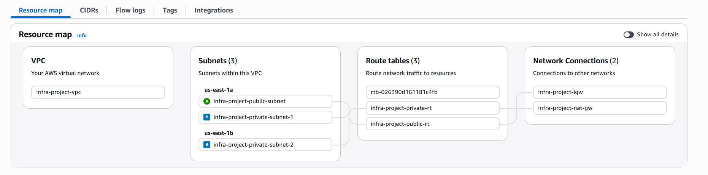
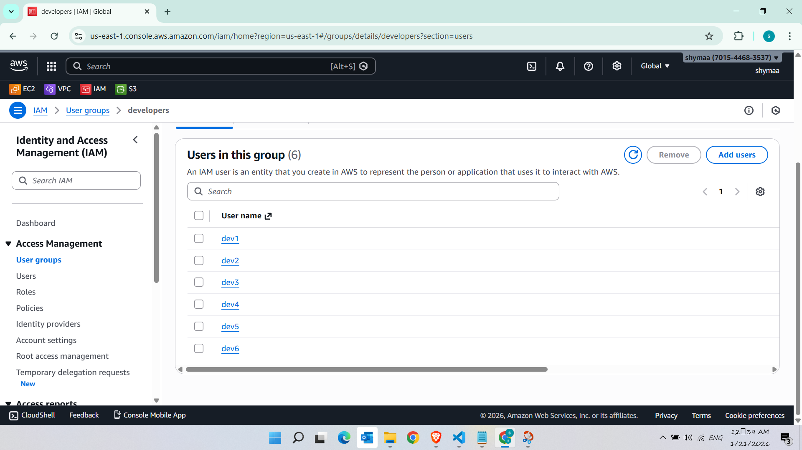
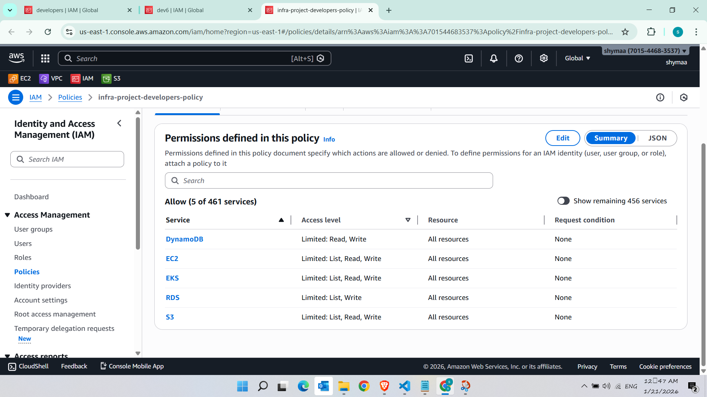
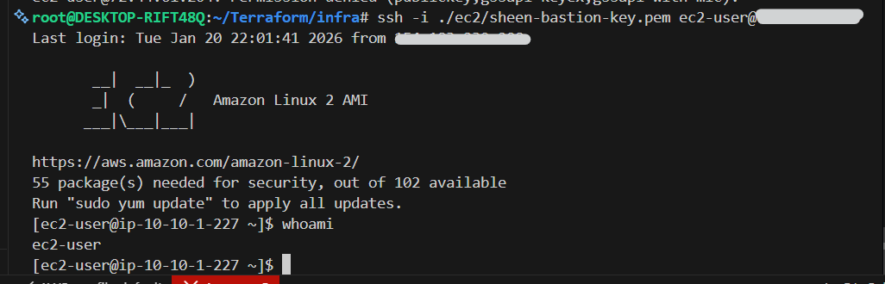
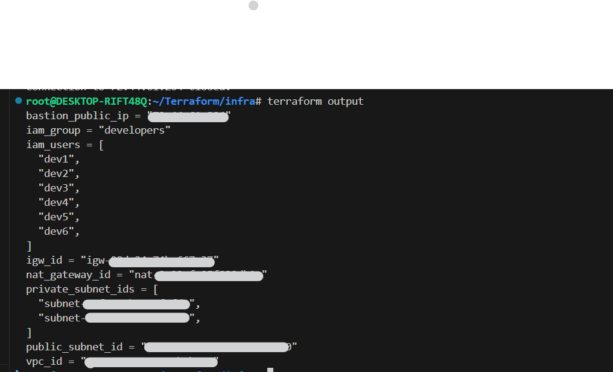

# Terraform S3 Backend with DynamoDB State Lock

## Prerequisites
- AWS Account
- AWS CLI installed
- Terraform installed

## Step 1: AWS CLI Configuration

```bash
aws configure
# Enter your AWS Access Key ID
# Enter your AWS Secret Access Key
# Enter default region (e.g., <aws-region>)
# Enter default output format (json)
```

## Step 2: Create IAM User for Terraform

```bash
# Create user
aws iam create-user --user-name <terraform-user-name>

# Create access key
aws iam create-access-key --user-name <terraform-user-name>
```

## Step 3: Attach Policy to User

```bash
aws iam attach-user-policy --user-name <terraform-user-name> \
    --policy-arn arn:aws:iam::aws:policy/AdministratorAccess
```

## Step 4: Create S3 Bucket for State

```bash
aws s3api create-bucket --bucket <s3-bucket-name> --region <aws-region>
aws s3api put-bucket-versioning --bucket <s3-bucket-name> \
    --versioning-configuration Status=Enabled
```

## Step 5: Create DynamoDB Table for Locking

```bash
aws dynamodb create-table --table-name <dynamodb-table-name> \
    --attribute-definitions AttributeName=LockID,AttributeType=S \
    --key-schema AttributeName=LockID,KeyType=HASH \
    --provisioned-throughput ReadCapacityUnits=5,WriteCapacityUnits=5
```

## Step 6: Configure Terraform Backend

Create `backend.tf`:

```hcl
terraform {
    backend "s3" {

        bucket         = "<s3-bucket-name>"
        key            = "<terraform-state-key>"
        region         = "<aws-region>"
        dynamodb_table = "<dynamodb-table-name>"
        encrypt        = true
    }
}
```

## Step 7: Initialize Terraform

```bash
terraform init
terraform plan
terraform apply
```
# create High Available infra using Terraform custom  Modules 
 to create a vpc , 1 public subnet , 2 private subnets 
 1 internet gateway , 1 nat gateway , route tables ,ec2 instance in public subnet to work as bastion host with pem key 
 Group Users and Attach Group Policy with limitation to Read & write on [Ec2,Rds,s3,EKS,dynmo]
Root directory tree
```
.
├── README.md
├── backend.tf
├── ec2
│   ├── main.tf
│   ├── output.tf
│   ├── sheen-bastion-key.pem
│   └── variable.tf
├── iam
│   ├── main.tf
│   ├── output.tf
│   └── variable.tf
├── igw
│   ├── main.tf
│   ├── output.tf
│   └── variable.tf
├── main.tf
├── ngw
│   ├── main.tf
│   ├── output.tf
│   └── variable.tf
├── output.tf
├── provider.tf
├── rt
│   ├── main.tf
│   ├── output.tf
│   └── variable.tf
├── s3
│   ├── main.tf
│   ├── output.tf
│   └── variable.tf
├── subnet
│   ├── main.tf
│   ├── output.tf
│   └── variable.tf
├── terraform.tfvars
├── variable.tf
└── vpc
    ├── main.tf
    ├── output.tf
    └── variable.tf

9 directories, 33 files
```

## Step 8: Initialize AWS infra 

```bash
terraform init
terraform plan
terraform apply
#to navigate outputs you can redirect the output 
terraform output >terraform-output
#after finishing you will find a pem key inside ec2 directory to ssh bstion host 
chmod 400 path/key.pem
ssh -i path/key.pem ec2-user@public-ip 
```

## Notes
- If you configured Backend before , use <terraform init -reconfigure>
- Remember to replace placeholders (e.g., `<s3-bucket-name>`, `<aws-region>`) with actual values.
- add vars to terraform copy.tfvars because its empty file and move it to terraform.tfvars


## AWS Gallery
# Resource Map of VPC


# Developers Setup


# IAM Policies and Roles


# Bastion Host SSH Connection


# Terraform Output


# Infrastructure Graph
 


